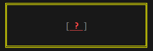

# [@je-es/style](../../../README.md) API

| API             | Desc                                                                    |
| --------------- | ----------------------------------------------------------------------- |
| [Style](#style) | Applies various styles to a given string based on the provided options. |
| [Design](#design) | Applies various styles to a given values based on the provided pattern. |

---

- #### Style

    - **Prototype**

      ```ts
      type t_padding =
      {
          top             ?: number,
          bottom          ?: number,
          left            ?: number,
          right           ?: number
      };

      type t_prefix =
      {
          val              : string,
          fg              ?: t_color,
          bg              ?: t_color
      }

      type t_border =
      {
          width           ?: number,
          fg              ?: t_color,
          bg              ?: t_color
      };

      type t_align =
      'center' | 'right' | 'left';
      ```

      > See [@je-es/ansi/t_color](https://github.com/je-es/ansi/blob/main/src/docs/src/api.md#style) for more info.

      ```ts
      interface i_style
      {
          // foreground/background/attributes
          fg              ?: t_color,
          bg              ?: t_color,
          attr            ?: t_attr,

          // padding/border
          padding         ?: t_padding,
          border          ?: t_border,

          // prefix/suffix
          prefix          ?: t_prefix,
          suffix          ?: t_prefix,

          // alignment/width
          width           ?: number,
          align           ?: t_align,
      }
      ```

      ```ts
      const style
      = (str : string, options : i_style)
      : string
      ```

    - **Example**

      ```ts
      import { style } from '@je-es/style';

      const res = style(' ? ',
      {
          fg      : 'red',
          attr    : ['bold', 'underline'],

          prefix  : { val: '[', fg: '#222' },
          suffix  : { val: ']', fg: '#222' },

          padding : { top: 1, bottom: 1, right: 2, left: 2 },
          border  : { width: 2, fg: [255, 255, 0] },

          width   : 25,
          align   : 'center'
      });

      console.log(res);
      ```

      _Result_

      


- #### Design

    - **Prototype**

      ```ts
      interface t_pattern
      {
          name            : string,
          style           : i_style,
          endWithNewLine ?: boolean,
          begWithNewLine ?: boolean,
          autoEnd        ?: boolean // if false, disabe endWithNewLine and begWithNewLine
      };

      type t_patterns = t_pattern[];
      ```

      ```ts
      const pattern
      = (pat : t_pattern | t_patterns)
      : t_pattern | t_patterns => pat
      ```

      ```ts
      const design
      = (pat : t_pattern | t_patterns, val : any)
      : string
      ```

    - **Example**

        ```ts
        import { pattern, design } from '@je-es/style';

        const pat = pattern
        (
            [
                { name: 'firstName',    style: { prefix: { val: 'Name: ', fg: '#222' }, fg: 'green' } },
                { name: 'lastName',     style: { fg: 'green' }, endWithNewLine: true },
                { name: 'Age',          style: { prefix: { val: 'Age: ', fg: '#222' }, fg: [255, 255, 0], attr: ['bold'] } }
            ]
        )

        const val =
        {
            'firstName' : 'Maysara',
            'lastName'  : 'Elshewehy',
            'Age'       : 24
        }

        console.log( design(pat, val) )

        ```

      _Result_

      

---

### Related

  - [@je-es/ansi](https://github.com/je-es/ansi)

---


> **Made with ❤ by [Maysara Elshewehy](https://github.com/Maysara-Elshewehy)**
